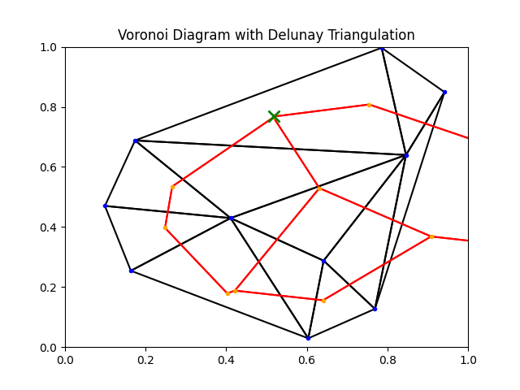

# Voronoi Diagram Visualizator

Simple Python program to draw Voronoi Diagram with Delunay Triangulation. 

## Example

### Input data

Input data is the file that [Vornoi Diagram](https://github.com/Dar3cz3Q/voronoi-diagram) generates. It is ```visualize.txt``` file.
You simply put this file in visualizator directory and run the program.

### Output data



## Running program

```
pip install numpy
pip install matplotlib

python main.py
```